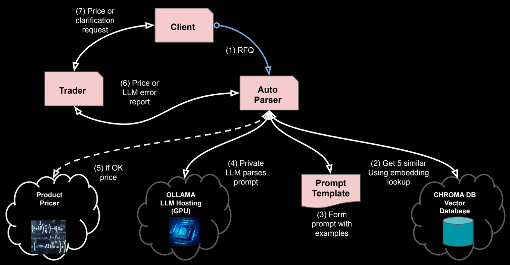

# Automating Tedious Tasks with AI: RFQ Parsing with RAG

Click here for [Demo project repository](https://github.com/parrisma/rfq-rag/) & full code

## Notes

* **All** data, names, products etc in the demo are **totally fictional** and designed & invented **just for illustration**.
* The financial products are only partially defined, with sufficient just to prove they can be differentiated.

## Contents

1. [Overview](#overview)
1. [Learnings & conclusion](#learning)
1. [Approach](./main)
1. [Deployment](./deployment)
1. [Full Prompt with examples](./main/rfq-prompt-with-examples.html)
1. [Demo Examples](./demo)
1. [Concepts](./concept.md)

## Overview

Finance automation has evolved. Pattern matching and traditional NLP are being replaced by **Retrieval Augmented Generation (RAG)**. This allows Large Language Models (LLMs) to understand the meaning of written requests. The smart jump to RAG lets you safely incorporate proprietary and specialised knowledge in AI workflows and can help address the critical issue of explainability. This jump is possible today, using locally or privately hosted models and readily available and opensource tools like vector databases.

This functional demo parses structured product requests for quotes. It handles requests in English, French, and Spanish, colloquial language, abbreviations, and typos, for two types of structured product. It can reliably extract the required pricing parameters, provide a full explanation of the LMM’s interpretation and assumptions, and deliver a confidence level for quoting, along with a written request for clarification when needed.

## Core Concepts

1. **Understanding**
    * Large language models [understand](./main/rfq-prompt-with-examples.html#rules) the meaning of text, not just the words. This lets them interpret requests like 'extract pricing terms' even if there are abbreviations, shortcuts, or mistakes. And they can work across languages, like in our demo with Spanish, French, and English.
1. **Augmentation**
    * LLMs convert text into a kind of 'meaning code' called embeddings. This allows them to see when texts are similar. We use this to store correctly interpreted past RFQs in a special database (vector database), where the 'meaning code' is the key. So when we ask the LMM to interpret a new RFQ, the system finds similar past RFQs and their correct interpretations and adds them to the prompt. This helps the LLM give a more accurate answer, as it can use validated and very specific knowledge
1. **Explainability**
    * When AI makes decisions, we need to be able to explain how it arrived at those decisions or assumptions. If something goes wrong, we must be able to show why the AI made a certain choice. With the demo, the LLM explains its reasoning in plain language and provides a confidence score. If the score is low, the automation is interrupted to seek more clarification, this makes the process more reliable and transparent.

## Learning

1. LLM's can do the bulk of the work in such "comprehension" use cases.
1. The tooling is both commoditised and open source with enterprise equivalents as needed.
1. The RAG model with examples, tuning of model [temperature](https://medium.com/@marketing_novita.ai/what-are-large-language-model-settings-temperature-top-p-and-max-tokens-a482d8d817b2) etc can give well behaved and deterministic results.
1. In a finance context, explainability can be partly addressed as the model can detail how the request was interpreted.

So with guard rails and subject to being able to get regulatory approval, it's a fairly simple process to build out such solutions that in the past may have been knotty regular expression parsers or NLP that needed 1000's of training data.

## Technology

1. [Ollama](https://ollama.com/) to run an host LLM's.
1. [ChromaDB](https://www.trychroma.com/) the vector database to support sematic augmentation.
1. [Langchain](https://www.google.com/search?q=https://python.langchain.com/docs/get_started/introduction.html) prompt building.
1. [Python](https://www.python.org/) as glue language.

## WorkFlow

The full workflow is shown below.

1. **RFQ From Client**
    * free text in any of three languages for two product types
1. **Get similar examples to client RFQ**
    * Use embeddings & vector DB to get semantically similar quotes
1. **Create the prompt with RFQ & examples**
    * Supply examples to prompt to give LLM specialist knowledge
1. **Ask LLM to extract parameters & explanation**
    * The explanation helps with the AI explainability problem if the result is questioned by client in the future
1. **If all OK price the product**
    * If extract is confident, we can auto price
1. **Pass price or error report to trader**
    * The price will be sent back, normally via person for sanity checks
    * Trader can also look a clarification commentary from model
1. **Pass price or request for clarification with client**
