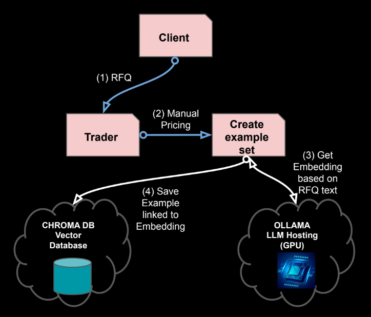
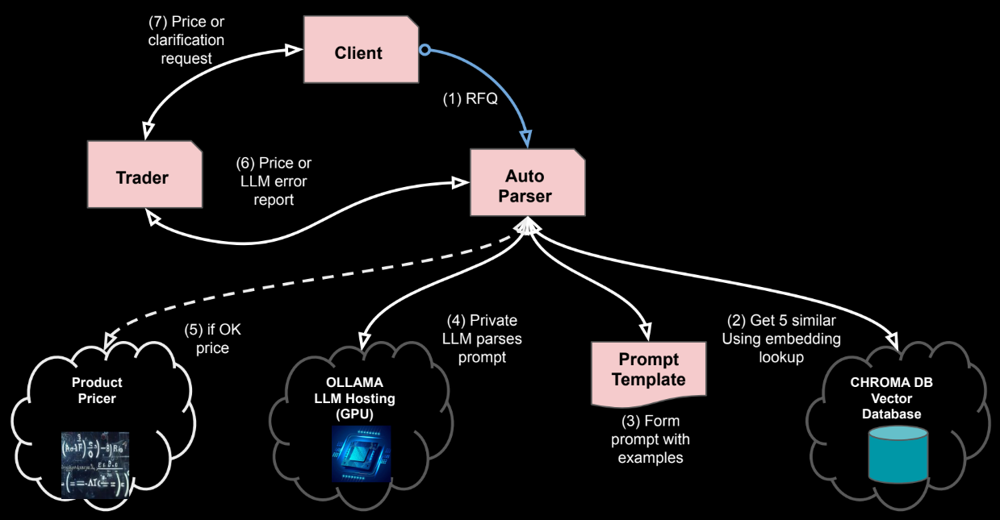

# Overview

Click here for [Demo project repository](https://github.com/parrisma/rfq-rag/) & full code

**NOTE** *all product terms, names etc used in this demo are 100% fictional, made up just for the purpose of illustration.*

## Table of Contents

- [Design Overview](#design-overview)
- [Problem Statement](#problem-statement)
- [Application of RAG](#application-of-rag)
- [Demo Operation](#create-examples)
    1. [Creating Example RFQs](#create-examples)
    1. [Retrieve Relevant Examples](#retrieve-relevant-examples)
    1. [The full Flow](#the-full-flow)

--- 

## Design Overview

Retrieval Augmented Generation (RAG) is a valuable technique when you need a Large Language Model (LLM) to generate responses based on:

* **Up-to-date information:** For tasks involving very recent news.
* **Internal data:** For accessing your organization's proprietary information.
* **Specialized interpretations:** For requiring context-specific understanding beyond general knowledge.

---

## Problem Statement

**Objective:** 
* Automate RFQ pricing detail extraction for seamless client quoting.

**Key Results:**

* Accurate, multilingual (EN, FR, ES) pricing data structured for automated systems reply.
* Confidence scoring implemented to prevent low-confidence automated responses.
* Clear, LLM-generated explanations of parsing assumptions provided.
* Client clarification requests generated when necessary.

---

## Application of RAG

1. **Create Examples** Select cross section of relevant data to act as examples in prompt.
1. **Receive RFQ to automate** 
1. **Retrieve Relevant Examples:** Gather examples related to the current RFQ automation.
1. **Augment the Prompt:** Add example directly in the prompt to automate RFQ response.
1. **Prioritize the Examples:** LLM responds with given examples as source of truth.
1. **Reply to Client**: Process RFQ of if LLM response ambiguous, seek client clarification

---

## Creating Example RFQs

We need to [create a varied set of RFQ examples](https://github.com/parrisma/rfq-rag/blob/main/rfq_generator.py), covering different clients, languages, and products, and manually verify the pricing for each, given a request and response we can save for later use.



The demo project creates totally fictional requests for quote for two financial products. These RFQ,s, by design, are colloquial, with typo's and abbreviations and are in three languages, examples below

```text
> Veuillez tarifer cette eln. Coupon 3 pct fix, Action RSH.T,  40 pct, Taille USD $40000, Terme 2 ans, Fréq Cpn annuel, Part 70 pct. Veuillez répondre quand vous le pouvez. David

> Necesito un precio para esta autocall RFQ, gracias. Monto USD $50000, Sub EDA.US, Venc 3 años, Cupón an, frecuencia auto trim, barr auto 100 porcentaje,  60 pct,  15 pct. Saludos, avísame. Alejandro

> Need a price on dis eln RFQ, thx.  40 percent, Cpn 2 % fixed, Under TPH.SW, Notional USD $5000,  quarterly, Participation 90 percent, Mat 2 yrs. Thank you in advance for your prompt response. Grace
```
For each example we also remember the exact details, such that we can save and use the text and the expected result as examples to give to the model. Ultimately it is these details we need to automated the pricing reply to teh client.
e.g.
```json
"parameters": {
    "underlying": "TGF.PA",
    "maturity": "1 years",
    "barrier": "60 percent",
    "coupon": "annually",
    "coupon_rate": "10 percent",
    "autocall_frequency": "annual",
    "autocall_barrier": "102 percent",
    "notional": "USD $10000",
    "from": "Ben Davis",
    "language": "en"
}
```

---

## Retrieve Relevant Examples

### Explanation

A big part of RAG is being able to find examples to add to the prompt that are similar in *meaning*, in our case similar quotes. 

Imagine you want to find wise quotes that are similar in meaning to a specific one, not just ones that use the same words. Regular text search is like looking for an exact word match, missing the underlying message. 

To solve this, we use embeddings and vector databases. Embeddings turns quotes into sets of numbers that capture their meaning. Think of it as creating a map where quotes with similar meanings are placed closer together. 

Vector databases store these number-maps along with the original quotes. So when you ask for quotes with similar meaning, the database finds the number-maps that are closest to your example, and then gives you the corresponding quotes. 

So, it allows computers to understand the "gist" of the quotes and find related ones based on their meaning, not just their words.

### Example

if we get the RFQ
```text
¿Podría cotizar este instrumento autocall?  1 años, Subyac CIF.T,  semestralmente,  semestralmente, Barrera 60 pct,  12 porcentaje,  105 %, Nominal USD $20000. Por favor avisa cuando tengas precios disponibles. Enrique Martínez
```
We need five similar examples, with the expected parameters (as JSON) to embed in the prompt. So we ask the vector DB (Chroma) to search for similar examples we saved earlier. 

As we can see below it has found examples in spanish (even tho the database has english and spanish also), they are also for the same financial product. 

The *Dist* number is the measure of how *far* they are away in *meaning* terms from the given rfq.

```text
> Dist: [7661.57], Doc: Oye, cotiza esta autocall. barr auto 105 porcentaje, Nominal USD $10000, frec llamada semestralmente, Subyacente LZL.US, Plazo 1 años,  12 %, Barrera 50 %, Cupón semi. Por favor, házmelo saber cuando tengas el precio. Francisco Martínez

> Dist: [9708.86], Doc: Estoy buscando una cotización rápida para esta autocall. Barrera 50 %, frec auto anual,  anual, Venc 2 años,  15 porcentaje, Subyac YSR.MX, Nominal USD $40000, barrera auto 100 %. Gracias, avísame pronto. Francisco Martínez

> Dist: [14481.69], Doc: Oye, ¿alguna idea de precio para esta autocall RFQ? Cantidad USD $45000, Barrera 50 %, barr auto 102 pct,  15 %, Expiración 2 años, frecuencia auto anualmente, Cupón anualmente,  CDM.HK. Avísame tus pensamientos. Alejandro Ruiz

> Dist: [18032.08], Doc: Necesitamos un precio para esta autocall. frecuencia de autocall anual, Plazo 5 años,  anual, Acción LZL.US,  70 pct, barrera de autocall 102 porcentaje, Cantidad USD $20000,  10 porcentaje. Por favor avisa cuando tengas un precio. Ivonne Williams

> Dist: [18782.44], Doc: ¿Alguna posibilidad de conseguir una cotización para esta nota autocall?  8 porcentaje,  102 %, Cup anualmente, frec anualmente, Ticker LVL.PA,  USD $40000, Barrera 50 %, Expiración 5 años. Avísame cuando lo tengas. Jacobo
```

### Resulting Prompt

Here is a full example of an RFQ [prompt with examples](./rfq-prompt-with-examples.html). The added examples are in red and the prompt being parsed is shown in blue.

This prompt was formed using [langchain](https://www.langchain.com/) library, which takes a simple [text template](https://github.com/parrisma/rfq-rag/blob/main/langchain_prompt.py) and allows values to be embdded.

The [rfq prompt above](./rfq-prompt-with-examples.html) is all **totally imaginary** data, but if you cut and paste the whole prompt into any web based LLM such as Gemini, you will see that it can parse the rfq and will give output as below. This is exactly what we do in the demo, except the LLM we call is one running locally (privately) on our computer. 

Here is a real json response from running the demo prompt
```json
[
    {
        "product": "eln",
        "underlying": "TER.L",
        "maturity": "12 years",
        "participation": "80 percent",
        "barrier": "50 percent",
        "coupon": "2 percent",
        "coupon_type": "fixed",
        "coupon_frequency": "quarterly",
        "notional": "USD $35000",
        "from": "Ali",
        "confidence": "100%",
        "explanation": "Extracted all parameters based on the patterns observed in the provided examples. The term 'qtr' is interpreted as 'quarterly', and 'Und' is interpreted as 'underlying'. 'Mat' is interpreted as maturity. The coupon is indicated as '2 % fixed' which is parsed as coupon of 2 percent and coupon type of fixed.",
        "advice": "ok to quote"
    }
]
```

e.g. a simplified example of a prompt template
```python
# A very simplified RFQ template
template = PromptTemplate.from_template(
    """
    Please quote this RFQ {rfq-text}
    with respect to these example rfq's and associated results
    {example-1} = {example-1-params-json}
    {example-2} = {example-2-params-json}
    response as valid json of format
    "{'cpn'='?','maturity'='?','strike'='?'}"
    """
)

# Inject the configurable details
prompt = template.format(
    rfq-text="Please quote this eln with terms a, b, c... ",
    example-1="Please quote this eln with terms d, e, f... ",
    example-1-params-json="{'cpn'='d','maturity'='e','strike'='f'}",
    example-2="Please quote this eln with terms g, h, i ... ",
    example-2-params-json="{'cpn'='g','maturity'='h','strike'='i'}",
)
```

---

## The full Flow

The full workflow is shown below.



1. **RFQ From Client**
    * free test in any of three languagess fr two product types
1. **Get similar examples to client RFQ**
    * Use embeddings & vector DB to get sematically similar quotes
1. **Create the prompt with RFQ & examples**
    * Supply examples to prompt to give LLM specialist knowledge
1. **Ask LLM to extract parameters & explanation**
    * The explanation helps with the AI explainability problem if the result is questioned by client in the future
1. **If all OK price the product**
    * If extract is confident, we can auto price
1. **Pass price or error report to trader**
    * The price will be sent back, normally via person for sanity checks
    * Trader can also look a clarification commentary from model
1. **Pass price or request for clarification with client**

## A real demo example

The RFQ request
```text
J'ai besoin d'un prix pour la eln suivante. Cpn 6 pourcentage fix,  USD $40000,  90 %, Terme 18 ans, Fréq Cpn annuellement, Barrière 60 pourcentage, Sous-jac FAF.MX. Merci, j'apprécie votre assistance. François Martin
```

The LLM Explanation, goes some way to address explaionability 
```text
The RFQ explicitly mentions eln in the context of a structured equity derivative product. The terms provided, such as coupon (Cpn), barrier level, and underlying asset (Sous-jac FAF.MX), are consistent with an ELN (Equity Linked Note) structure. However, there is some ambiguity regarding the term Terme 18 ans which could be interpreted as a very long maturity period for an ELN, which is unusual but not impossible
```

The LLM Advice, trust extract or ask for clarification
```text
Dear François Martin, thank you for your request. Could you please clarify if the 18-year term is correct and intended for this ELN? Additionally, could you confirm the barrier level of 60% and how it applies to the structure? This will help ensure we provide an accurate quote. Best regards.
```

---

## Summary

### Upside
With a few commodity tools it is now possible to build workflows that can 
* Extract specialst details reliably 
* Process colloquial and multi ligual text
* Explain the resoning behind the process
* Self assess confidence levels to manage risk and escalations in automated flows.

### Downside
It's a more sophitocated stack than is traditional and it consumes a significant amount more compute.